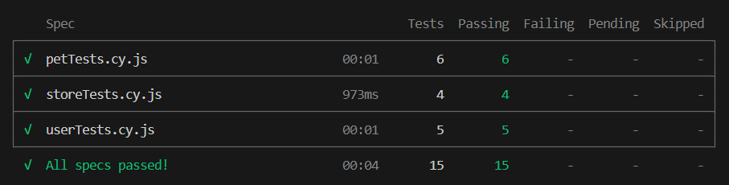
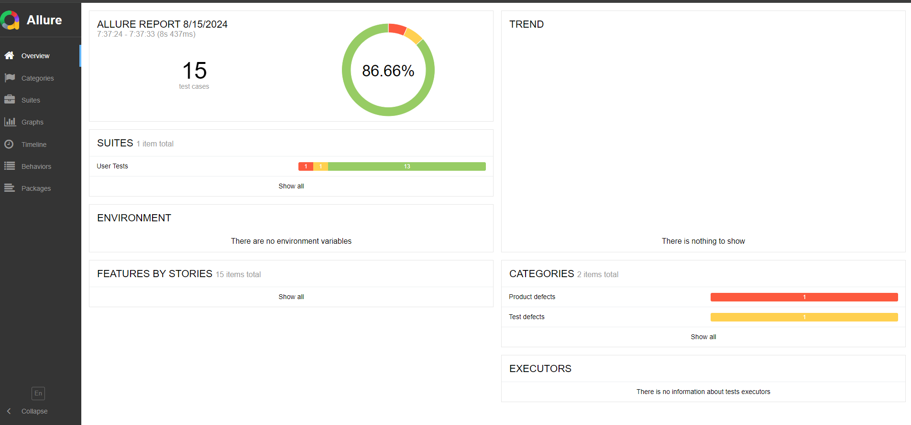

# Cypress Api Automation Tests

Proje açıklaması buraya yazılır.

## Başlangıç

Bu adımlar, projeyi yerel makinenizde çalıştırmak ve geliştirmeye başlamak için size rehberlik edecektir.

### Gereksinimler

Projenin çalışması için aşağıdaki yazılımların yüklü olması gerekmektedir:

- Node.js
- npm

### Kurulum

1. Projeyi klonlayın:
   
   ```sh
   git clone https://github.com/cevdetayaz/techcareer-cypress-api-tests.git
   ```
2. Proje dizinine gidin:
   
   ```sh
   cd techcareer-cypress-api-tests
   ```
3. Gerekli bağımlılıkları yükleyin:
   
   ```sh
   npm install cypress
   ```
4. Proje'yi çalıştırın:
   
   ```sh
   npx cypress run
   ```

Terminal üzerinde test sonuçları



### Raporlama

Testler çalıştrıldığında proje içindeki allure-result (yoksa otomatik oluşturulur) klasörüne test sonuçlarını yazar.

Test sonuçlarını allure report üzerinde görmek için aşağıdaki komut çalıştırılır.

```
npx allure serve allure-results
```

Açılan tarayıcı sayfasında sonuçlar görüntülenir.

https://allurereport.org/docs/cypress/

Allure Reports üzerinde test sonuçları



